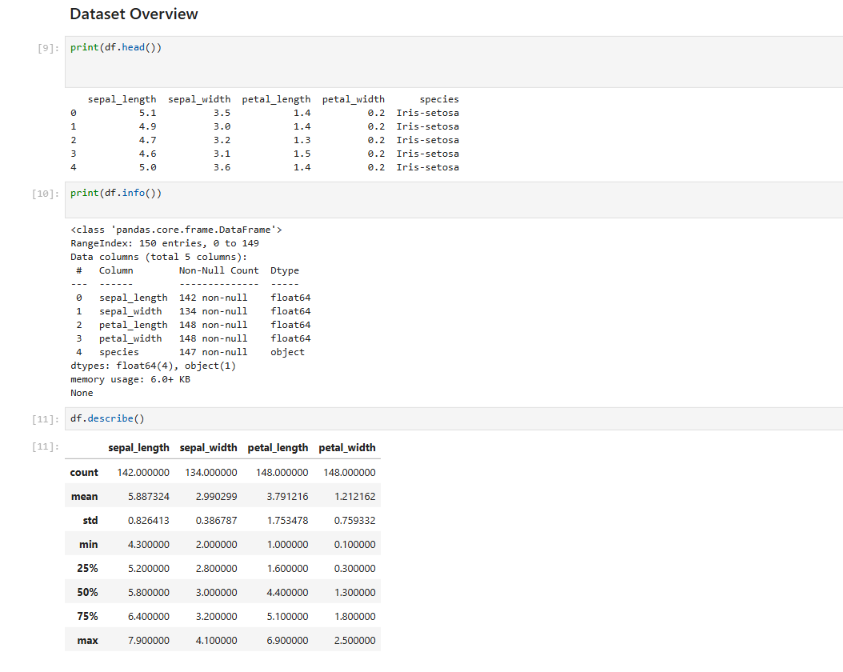
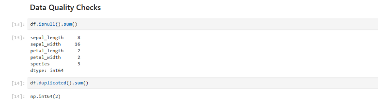
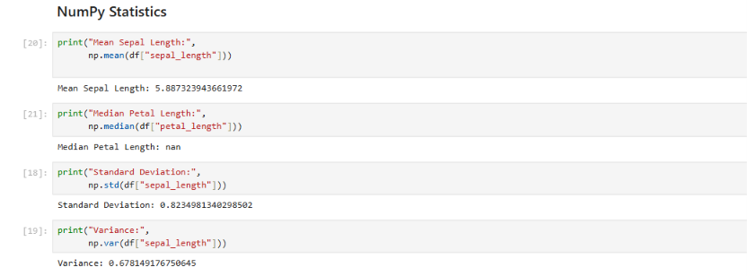
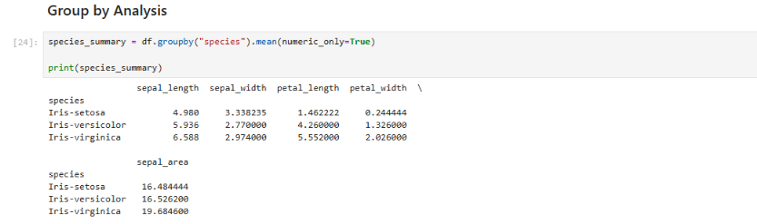
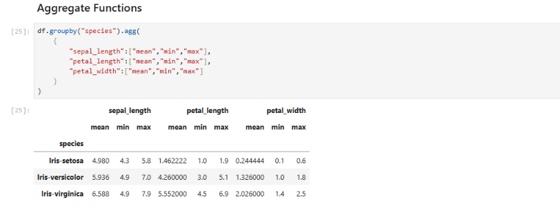

# Iris-Data-Analysis-Using-Pandas-and-NumPy


## Project Overview
This project performs Exploratory Data Analysis (EDA) on the Iris Dataset using Python, Pandas, and NumPy.

The goal is to analyze the dataset, check data quality, perform statistical analysis, and derive insights using various data manipulation techniques.

## Technologies Used
- Python
- Pandas
- NumPy
- Jupyter Notebook

## Dataset
The Iris dataset contains information about different species of iris flowers.

Features:
- Sepal Length
- Sepal Width
- Petal Length
- Petal Width
- Species

## Analysis Performed

### Data Quality Checks
- Checked for missing values
- Checked for duplicate records

### Dataset Exploration
- Viewed dataset structure
- Generated descriptive statistics
- Analyzed species distribution

### NumPy Statistics
- Mean
- Median
- Standard Deviation
- Variance
- Maximum and Minimum Values

### Advanced Pandas Operations
- Correlation Analysis
- Feature Engineering (Sepal Area)
- Data Filtering
- Data Sorting
- GroupBy Analysis
- Aggregation Functions

### Output Generated
- Species-wise Summary CSV File

## Project Structure

```
iris-analysis/
│
├── iris.ipynb
├── iris.csv
├── species_summary.csv
├── README.md
└── screenshots/
```

## Screenshots

### Dataset Overview


### Data Quality Checks


### NumPy Statistics


### GroupBy Analysis


### Aggregation Functions


## Key Learnings
- Data Cleaning
- Exploratory Data Analysis
- Pandas Data Manipulation
- NumPy Statistical Operations
- GroupBy and Aggregation Techniques

## Author

Sushant Choudhary

Computer Engineering Student | Data Science Enthusiast
